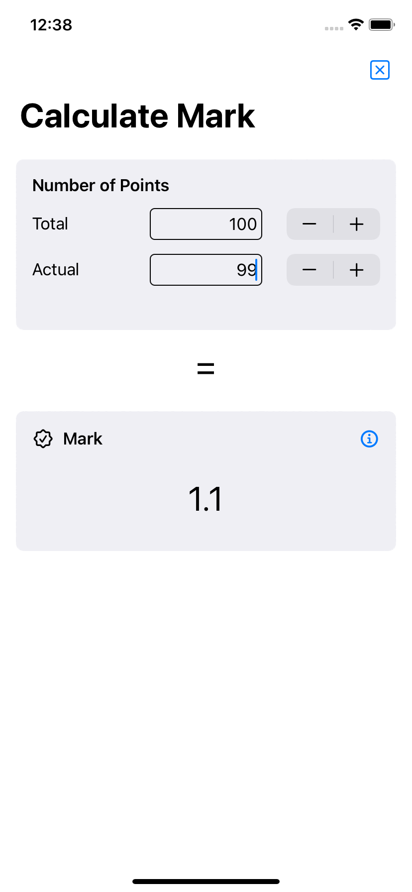

#  Mark Calculator

A simple iOS app to convert from a given actual and total number of points to a mark.

Currently there is a single formula used to compute the mark.
```
mark = 6 - ( actual points ÷ total points × 5 )
```

App icon by [SVG Repo](https://www.svgrepo.com/svg/128844/blackboard) licensed under [CC0 1.0 Universal](https://creativecommons.org/publicdomain/zero/1.0/)

## Screenshot


## License
MIT © Rüdiger Herrmann
